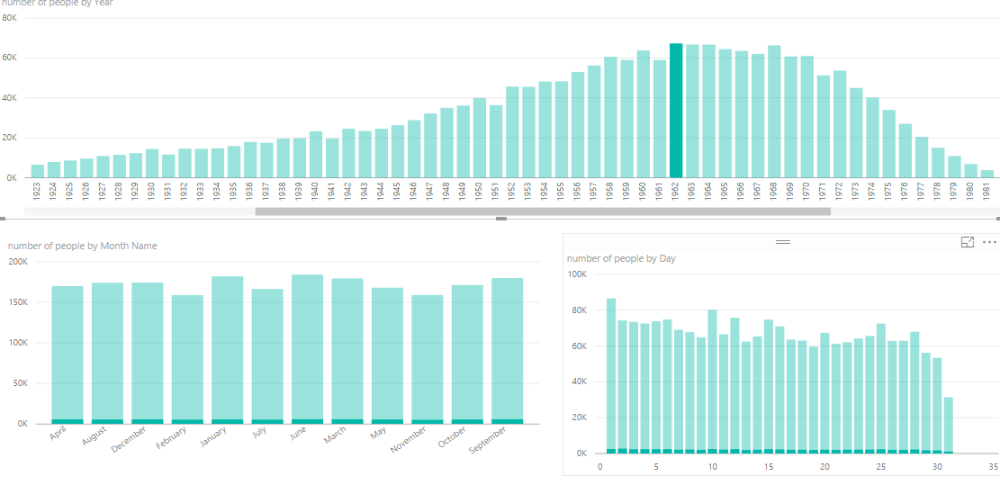
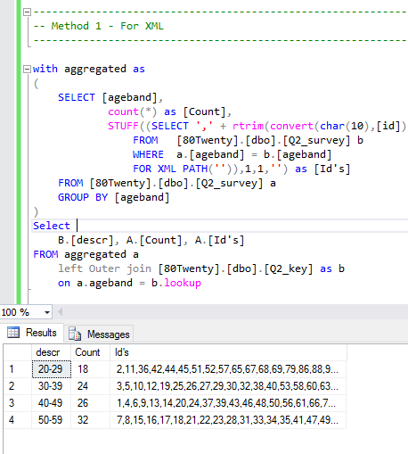
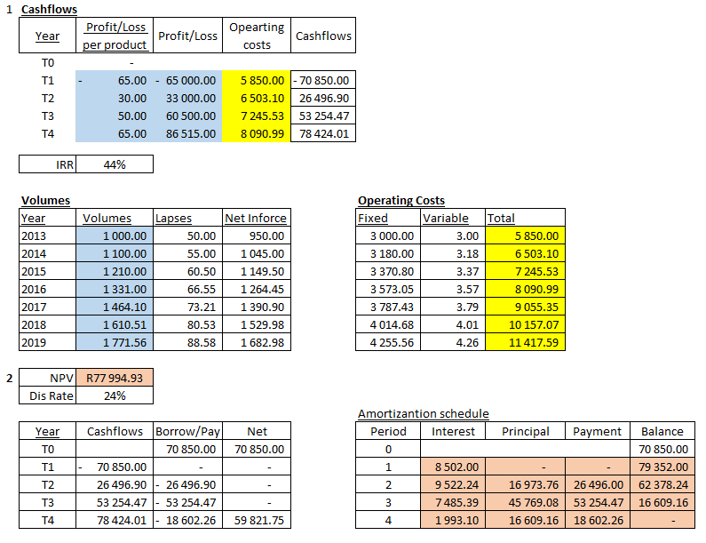
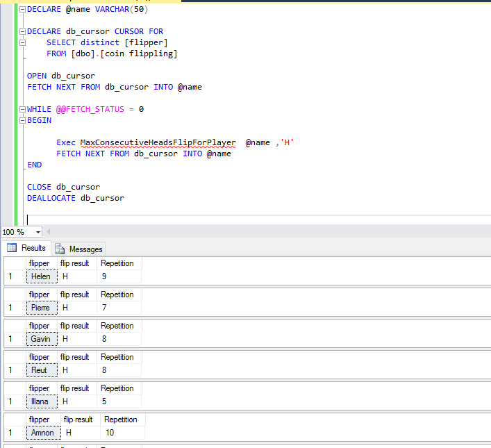

# BI_Insights_Challenge

<h1> Q1 - Birthdays </h1>

Analyzing the dispersion of ages we can see that the ages represent a bell curve with a long tail to the right. This tells us about the general demographic profile of customers. The clientelle of the company. Are mostly between the ages of 45 and 70. We can definatly see that the product is not popular with clients under the age of 30 but very relevant for older clients and only starts tailing off after around retirement age. Perhaps we could infer the company sells mortgages bonds or life insurance.

<h1> Q2 - Sql </h1>

<h1> Q3 - Financial Modeling</h1>

<h1> Q4 - Problem Solving </h1>

    Not yet completed

<h1> Advanced - Problem Solving</h1>

Craete a SP that uses The Recursive CTE design pattern to find the Highest Number of consecutive flips for a chosen coin side then used a cursor (not ideal) tpo iterate through each of the players for simplicity.

<h1> Advanced - Prime Proportions </h1>

    Not yet completed