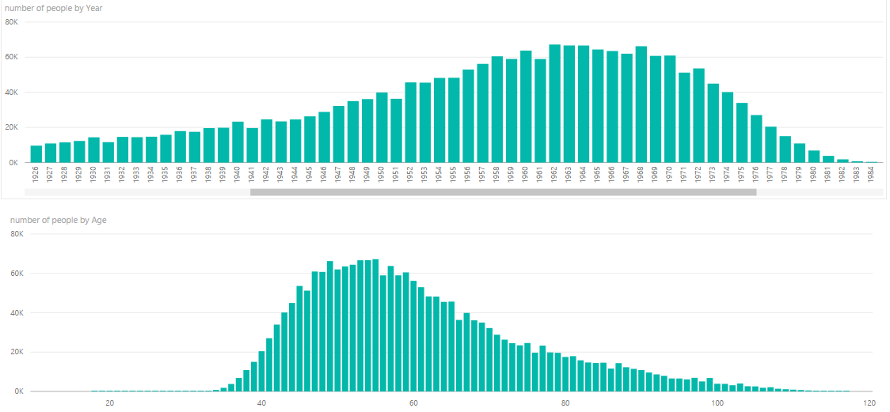

# BI_Insights_Challenge

<h1> Q1 </h1>

Analyzing the dispersion of ages we can see that the ages represent a bell curve with a long tail to the left. This tells us about the general demographic profile of customers. The clientelle of the company were born mostly between the 50's - 70's and as customers get older than this gereal age the clientelle gets vastly smaller per year older. This would tell us something about the usefulness or nature of the product by a general demopgrapic of customers.

<h1> Q2 </h1>

<h1> Q3 </h1>

<h1> Q4 </h1>
